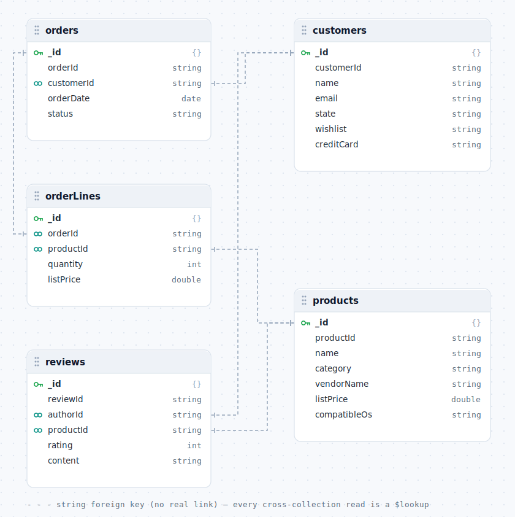
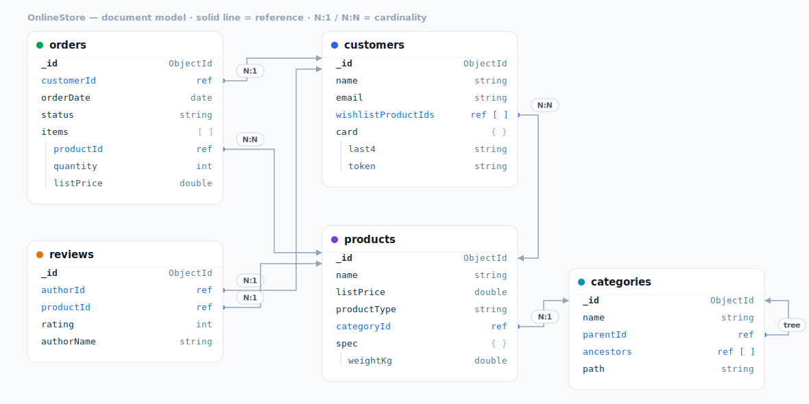
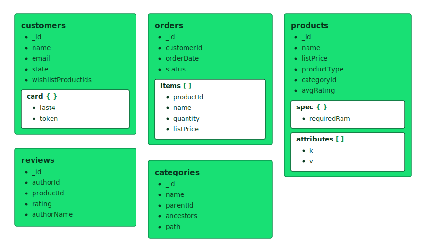

# NoSQL (Document) Database Design Patterns

> A hands-on catalogue of **document database design patterns**, implemented as a single MongoDB (`OnlineStore`) database that **evolves over time** — from a naive, table-for-table port of a relational schema into a properly keyed, indexed, embedded, referenced and denormalized document model.

The portfolio is a **sequence of migration scripts** (an initial naive port, the patterns, and an anti-patterns appendix), each tackling one real modeling decision — _"these order lines should be embedded"_, _"this reference needs a name snapshot"_, _"this array is unbounded, now what?"_ — and each ending with an honest note on the **trade-off** and **when not to use it**.

It is the third repo in a set that models the **same `OnlineStore` domain** three ways, so they read together:

| Repo | Engine | The core move |
| --- | --- | --- |
| `advanced-database-design-patterns` | Relational (SQL Server) | Normalize into tables; enforce with keys & constraints |
| `graph-database-design-patterns` | Graph (Neo4j) | Turn foreign keys into relationships you traverse |
| **`no-sql-database-design-patterns`** (this repo) | **Document (MongoDB 7)** | **Decide what to embed vs. reference, per access pattern** |

The pattern taxonomy follows a document-modeling curriculum (embedding, referencing, tree structures, and the cross-cutting indexing/lifecycle patterns). Every script in this repo has been **run end-to-end against MongoDB 7** (the bundled Docker image) — the `explain()` plans, the rejected duplicate key, and the embedded-order output in the write-ups are captured from real runs, not aspirational.

---

## The model

`OnlineStore` starts as the naive relational port below and, migration by migration, becomes the idiomatic document model further down.

### Before — the naive port

[`src/000_initial_naive.js`](src/000_initial_naive.js) is deliberately imperfect: it carries relational habits straight into MongoDB — a random `ObjectId` `_id` beside a duplicate business id, relationships faked as **string foreign keys** (amber below), a separate `orderLines` collection, denormalized strings (`wishlist`, `category`, `creditCard`), and not a single index — so the later scripts have something real to fix. Every cross-collection read is a `$lookup`.

<p align="center">
  
</p>

### After — the document model

The natural key becomes `_id`, each access pattern gets its index, and the order carries its lines **embedded** inline (`items[]`, shown nested) — one self-contained document, one read, no join. What stays split is referenced by id (solid lines, with `N:1` / `N:N` cardinality); note the order↔product relationship is **N:N** (an order embeds many products, a product appears in many orders — verified against the data). The catalogue becomes a real `categories` **tree** (the `parentId` self-reference), and `reviews` keeps its own collection with a few fields copied across ([005](docs/patterns/005-extended-reference.md)). The high-volume `activity` stream is referenced then bucketed ([007](docs/patterns/007-referencing-unbounded.md)/[008](docs/patterns/008-bucket.md)) rather than embedded.

<p align="center">
  
</p>

<sub>Both diagrams are generated from a small model definition in [`docs/images/model.gen.js`](docs/images/model.gen.js) — edit the collections/fields/connectors there and run `node docs/images/model.gen.js` to re-render (the editable source next to the SVG, like the sister repos' Graphviz `.dot` files).</sub>

### Embedding at a glance

A complementary view of the same document model that foregrounds **what is embedded**: each collection is a document, and embedded sub-documents / arrays are drawn as **nested boxes** — `orders.items[]`, `customers.card{}`, `products.spec{}` + `attributes[]`. Collections with no embedding (`reviews`, `categories`) are flat, and id references stay as plain fields.

<p align="center">
  
</p>

<sub>Generated by [`docs/images/embedding.gen.js`](docs/images/embedding.gen.js) — run `node docs/images/embedding.gen.js` to re-render.</sub>

---

## The patterns

Row `000` is the naive port and diagnostic tooling; the 14 patterns follow, `014` an anti-patterns/diagnostics appendix. Each row links to the **runnable script** and a short **write-up**. The "What it solves" column names the decision, with the closest **relational/graph analog** from the sister repos in parentheses.

| #   | Pattern | What it solves (sister-repo analog) | Status |
| --- | --- | --- | --- |
| 000 | Initial naive port & diagnostics | The naive table-for-table starting point + introspection (≈ initial schema / initial graph). | ✅ [script](src/000_initial_naive.js) · [doc](docs/patterns/000-initial-naive.md) |
| 001 | Identity & keys | Natural key as `_id`, unique indexes, real BSON types (≈ primary key, 001). | ✅ [script](src/001_identity_and_keys.js) · [doc](docs/patterns/001-identity-and-keys.md) |
| 002 | Indexing strategy (ESR) | Single/compound/covered/partial/collation indexes, the ESR rule (≈ indexing strategy, 002/003). | ✅ [script](src/002_indexing_strategy.js) · [doc](docs/patterns/002-indexing-strategy.md) |
| 003 | Embedding (one-to-few) | Fold a bounded dependent entity into its parent — the defining move (≈ master/detail 011, inverse of graph FK→rel). | ✅ [script](src/003_embedding.js) · [doc](docs/patterns/003-embedding.md) |
| 004 | Snapshot data | Freeze name/price on the order line so history survives edits (≈ history/effective-dating, 012/013). | ✅ [script](src/004_snapshot.js) · [doc](docs/patterns/004-snapshot.md) |
| 005 | Extended reference / partial embedding | Copy the few fields you always display next to a reference, to skip the join (≈ lookup/reference table, 007/008). | ✅ [script](src/005_extended_reference.js) · [doc](docs/patterns/005-extended-reference.md) |
| 006 | Supertype / subtype polymorphism | One collection + a `productType` discriminator vs. embedded subtype (≈ subtype tables, 017/018). | ✅ [script](src/006_supertype_subtype.js) · [doc](docs/patterns/006-supertype-subtype.md) |
| 007 | Referencing (one-to-many, unbounded) | When *not* to embed: parent/child refs, two-way refs, the 16 MB limit (≈ foreign key, 003). | ✅ [script](src/007_referencing_unbounded.js) · [doc](docs/patterns/007-referencing-unbounded.md) |
| 008 | Bucket pattern | Group high-volume events (activity/history) into bucket documents (≈ horizontal partitioning, 014). | ✅ [script](src/008_bucket.js) · [doc](docs/patterns/008-bucket.md) |
| 009 | Many-to-many | Id arrays on one or both sides; querying both directions (≈ associative table, 010). | ✅ [script](src/009_many_to_many.js) · [doc](docs/patterns/009-many-to-many.md) |
| 010 | Attribute pattern (subdocuments vs arrays) | Array-of-`{k,v}` for flexible queries vs. subdocument when fields are fixed (≈ vertical partitioning, 015). | ✅ [script](src/010_attribute_pattern.js) · [doc](docs/patterns/010-attribute-pattern.md) |
| 011 | Computed pattern | Precompute `avgRating`/`numReviews` instead of aggregating on every read (≈ computed column, 022). | ✅ [script](src/011_computed.js) · [doc](docs/patterns/011-computed.md) |
| 012 | Tree structures | Parent refs / child refs / array-of-ancestors / materialized path for the category tree (≈ hierarchical data, 016). | ✅ [script](src/012_tree_structures.js) · [doc](docs/patterns/012-tree-structures.md) |
| 013 | Data lifecycle & integrity | `$jsonSchema` validation, TTL indexes, soft delete, PII obfuscation (≈ soft delete / obfuscation, 020/023). | ✅ [script](src/013_lifecycle.js) · [doc](docs/patterns/013-lifecycle.md) |
| 014 | Anti-patterns (appendix) | Read-only diagnostics: unbounded arrays, `$lookup` chains, over-embedding past 16 MB, treating Mongo like SQL. | ✅ [script](src/014_anti_patterns.js) · [doc](docs/patterns/014-anti-patterns.md) |

> ⚠️ The scripts are **sequential migrations** — each transforms the database left by the previous one. Run them in order (`conventions` → `000` → `001` → …); you can't apply one in isolation (e.g. `003` embeds the `orderLines` that `000` seeds and `001` re-keys).

### What you end up with

After all 15 scripts, the five naive collections have become **eight** that each demonstrate a decision:

| Collection | Shape it ended in | Patterns |
| --- | --- | --- |
| `customers` | natural `_id`, obfuscated card (`last4` + token), wishlist as a product-id array | 001, 009, 013 |
| `products` | polymorphic (`productType` + `spec`), open-ended `attributes[]`, cached `avgRating`, `categoryId`, soft-delete flag | 006, 010, 011, 012, 013 |
| `categories` | the category tree — `parentId` + `ancestors[]` + materialized `path` | 012 |
| `orders` | order lines **embedded** as `items[]`, each a purchase-time snapshot | 003, 004 |
| `reviews` | referenced, with `authorName`/`productName` copied across, `rating` validated | 005, 013 |
| `activity` | one document per event — unbounded, referenced (never embedded) | 007 |
| `activityBuckets` | the same events rolled into per-customer-per-day buckets | 008 |
| `sessions` | ephemeral, self-expiring via a TTL index | 013 |

---

## Run it yourself

Everything runs on **MongoDB 7 Community**, and the bundled Docker setup is self-contained — you don't need MongoDB or `mongosh` installed on your machine. The repo is mounted into the container at `/workspace`, and the commands below use the `mongosh` that ships inside the image.

### 1. Start MongoDB

```bash
docker compose up -d
```

This launches `mongo:7` on `localhost:27017`, no auth, with the repo mounted read-only at `/workspace`.

> **Port already in use?** If you already run MongoDB on `27017`, create a `.env` file next to `docker-compose.yml` with `MONGO_PORT=27018` (any free port) — Compose picks it up automatically and the two instances run side by side. The `docker exec … mongosh` commands below are unaffected, since they run _inside_ the container.

### 2. Apply every script, in order

```bash
# wait until MongoDB is ready
until docker exec onlinestore-mongo mongosh --quiet --eval 'db.runCommand({ping:1}).ok' >/dev/null 2>&1; do
  echo 'waiting for MongoDB...'; sleep 2
done

# conventions -> 000 (naive port + seed) -> 001..014, in order, stopping on first error
docker exec onlinestore-mongo bash -c '
  for f in /workspace/helpers/conventions.js /workspace/src/0*.js; do
    echo ">>> applying $f"
    mongosh --quiet "mongodb://localhost:27017/onlinestore" "$f" || { echo "FAILED at $f"; exit 1; }
  done'
```

Each script records itself in a `_migrations` collection on completion, so you can always see how far the model has evolved:

```bash
docker exec onlinestore-mongo mongosh --quiet "mongodb://localhost:27017/onlinestore" \
  --eval 'db.getCollection("_migrations").find().sort({_id:1}).forEach(m => print(m._id, m.description))'
```

For interactive exploration, open a shell with `docker exec -it onlinestore-mongo mongosh onlinestore` and paste queries from [`src/`](src/).

> On **Windows Git Bash**, run any *single* script through `bash -c '…'` (as the loop above does) so the `/workspace/...` path isn't rewritten to a host path.

### Reset to a clean slate

```bash
docker exec onlinestore-mongo bash -c 'mongosh --quiet "mongodb://localhost:27017/onlinestore" /workspace/helpers/reset.js'
```

Then re-run the sequence above to rebuild from `000`. (To wipe the data volume entirely instead, use `docker compose down -v`.)

---

## Repository layout

```
.
├── src/                 # The 15 numbered migration scripts (000 → 014), run in order
├── helpers/
│   ├── conventions.js   # Naming conventions + the _migrations bookkeeping collection
│   └── reset.js         # Drop the database back to empty
├── docs/
│   ├── patterns/        # One short write-up per pattern (problem / solution / trade-off)
│   └── images/          # before/after model diagrams (hand-authored SVG)
├── docker-compose.yml   # One-command MongoDB 7
└── README.md
```

## Naming conventions

Documented in [`helpers/conventions.js`](helpers/conventions.js), following the MongoDB / JavaScript community idiom (the relational sister repo uses `snake_case` for everything):

- **Collections** — lowercase plural nouns; `camelCase` for multi-word: `customers`, `orders`, `activityBuckets`
- **Fields** — `camelCase`, singular: `customerId`, `listPrice`, `orderDate`
- **Identity** — the natural business key **is** the `_id` (`_id: 'C1'`), not a duplicated field — itself the small design lesson behind pattern [001](docs/patterns/001-identity-and-keys.md)
- **References** — `<entity>Id` / `<entity>Ids`; **discriminator** — `<entity>Type`

---

## License

Code and documentation © Michał Panasiuk, released under the [MIT License](LICENSE).
